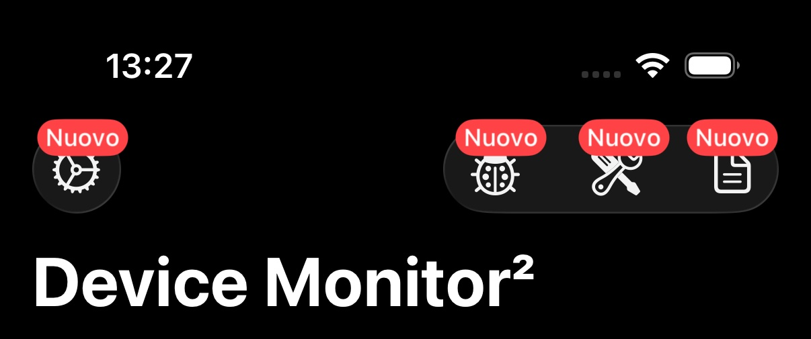
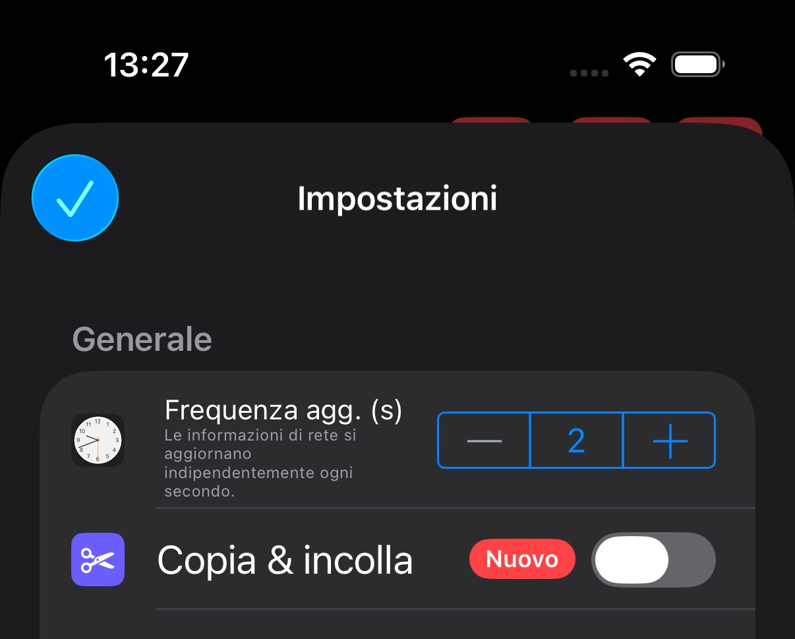

# MRBadgeDisplayCoordinator

[](https://swift.org/package-manager/)

[](https://swift.org)
[](https://developer.apple.com/xcode)
[](LICENSE)
[](https://twitter.com/FastDevsProject)

Lightweight coordinator that keeps badge counts in sync across multiple UI entry points. Schedule a badge once, attach it to any `UIView` or `UIBarButtonItem`, and let the coordinator handle the rest.




## Features

- Coordinate one canonical badge state per identifier and reuse it across views.
- Attach badges to any `UIView`; `UITableViewCell` instances automatically forward to their `contentView`.
- Display native `UIBarButtonItem.badge` values on iOS 26 while providing a custom overlay fallback for arbitrary views.
- Keep attachments up to date through weak references, so reused views automatically reflect the current badge state.
- Clear badges individually or reset the entire coordinator in one call.
- Persist badge lifecycle state to a dedicated `UserDefaults` suite so cleared identifiers are remembered across launches.

## Requirements

- iOS 26.0+
- Xcode 26.0+
- Swift 5.10+

## Installation

### Swift Package Manager

Add the package to the `dependencies` array of your `Package.swift`:

```swift
dependencies: [
    .package(url: "https://github.com/furiosFast/MRBadgeDisplayCoordinator.git", from: "1.0.0")
]
```

Then add `MRBadgeDisplayCoordinator` to the target dependencies that need badge coordination.

## Getting Started

```swift
import MRBadgeDisplayCoordinator

final class InboxViewController: UIViewController {
    private let coordinator = MRBadgeDisplayCoordinator.shared

    @IBOutlet private weak var inboxButton: UIButton!

    override func viewDidLoad() {
        super.viewDidLoad()

        coordinator.scheduleBadge(for: "inbox", payload: BadgePayload(text: "12"))

        coordinator.attachBadgeIfNeeded(to: inboxButton, identifier: "inbox")
    }
}
```

### 1. Schedule or Update Badge State

```swift
MRBadgeDisplayCoordinator.shared.scheduleBadge(for: "notifications", payload: BadgePayload(text: "3"))
```

- Identifiers let you share the same badge value across any number of views.
- Repeated calls with the same identifier update the stored payload and refresh every attachment.

### 2. Attach to Views

```swift
coordinator.attachBadgeIfNeeded(to: avatarImageView, identifier: "notifications")
coordinator.attachBadgeIfNeeded(to: tableViewCell, identifier: "notifications")
```

- Attach in `viewDidLoad`, `viewWillAppear`, or inside cell configuration.
- When the coordinator already has a badge for that identifier, the view immediately displays it; otherwise the view is cleared.
- `UITableViewCell` instances automatically apply the badge to their `contentView`, so the bubble stays positioned even when cells are reused.

### 3. Attach to Bar Button Items

```swift
coordinator.attachBadgeIfNeeded(to: navigationItem.rightBarButtonItems?.first, identifier: "notifications")
```

### 4. Clear Badges

```swift
MRBadgeDisplayCoordinator.shared.clearBadge(for: "notifications")
MRBadgeDisplayCoordinator.shared.clearAll()
```

- `clearBadge(for:)` removes a specific identifier and clears every attached view.
- `clearAll()` wipes both state and attachments, useful when a user signs out or you want a clean slate.

### Checking Badge State

```swift
if MRBadgeDisplayCoordinator.shared.hasBadgeScheduled(for: "notifications") {
    // e.g. keep a row highlighted
}
```

Use this to keep other UI in sync without reattaching a badge.

### Persist Badge State Across Launches

Call `configurePersistence(using:)` once (for example in your application delegate) to mirror every badge mutation to a dedicated `UserDefaults` container:

```swift
let defaults = UserDefaults(suiteName: "group.com.fastdevs.badges") ?? .standard
MRBadgeDisplayCoordinator.shared.configurePersistence(using: defaults)
```

- Pending and displayed badges are restored on launch, so attaching views shows the latest value immediately.
- When you call `clearBadge(for:)`, the identifier is recorded with status `.removed`. Query it later with `MRBadgeDisplayCoordinator.shared.status(for: "notifications")`.
- `clearAll()` marks every tracked identifier as `.removed` before removing in-memory state, keeping the persisted history consistent.

## Customising the Overlay

The coordinator ships with a rounded `BadgeOverlayLabel` that respects layout margins and adapts to Dynamic Type. To adjust the layout:

- Override `layoutMargins` on your view to reposition the overlay.
- Extend `BadgeOverlayLabel` inside your app to tweak colors or fonts, or replace the view entirely by calling `showBadgeOverlay(text:)` directly on a `UIView`.

## License

MRBadgeDisplayCoordinator is released under the MIT license. See [LICENSE](LICENSE) for details.
